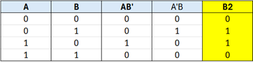
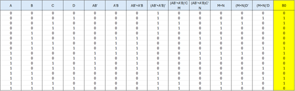
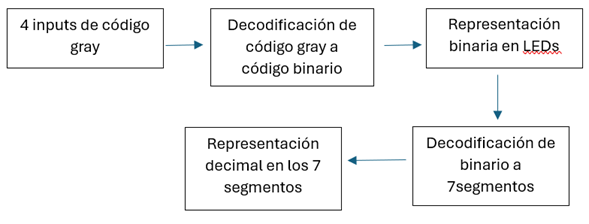

# Proyecto_1

**Participantes:**
- Steven Sancho Orozco
- Nombre 

**Profesor:**
Alfonso Chacón Rodriguez

**Fecha:**
1/09/2024

**Curso:**
Diseño lógico

## 1.	Resumen
En este proyecto se realiza una conversión de código de gray, de cuatro bits, a una representación binaria y decimal, mediante el uso de una FPGA, utilizando el lenguaje de System Verilog, aplicando lógica booleana y las debidas conexiones entre componentes

## 2.	Introducción
En este documento se pretende demostrar, aplicando lógica booleana, representar un código de gray de cuatro bits a una forma binaria utilizando cuatro LEDs de la FPGA utilizada, generando un código decodificador, el cual traduce la entrada del código gray a una representación binaria, además, se representa de una forma decimal el número ingresado mediante el uso de dos unidades de 7 segmentos, los cuales necesitan una decodificación de la representación binaria a su forma decimal, teniendo presente las conexiones para el debido uso de ambos 7 segmentos.

## 3.	Solución teórica
Primeramente, es necesario definir un código que represente la decodificación de la entrada de código gray para así poder tener una representación binaria donde mediante el uso de la FPGA dar la representación de cuatro bits de la representación binaria. En este caso solo se utilizaron compuertas “AND”, “OR” y “NOT” cuando fuera necesario. Como la entrada del código gray y la salida resultante de forma binaria son ambas de cuatro bits, se utiliza álgebra booleana para la representación de cada bit, para el bit en la posición 3(MSB) es igual para ambos casos, por lo tanto, esa posición se mantiene, para el bit en la posición 2(B2), se debe aplicar álgebra booleana donde B2=A’B+AB’, donde A y B es la representación de las entradas en las posiciones 3 y 2 del código gray.

Para los bits en la posición 1 y 0 también se aplica el álgebra booleana necesaria para poder obtener cada valor. En ambos casos se utilizan los valores establecidos en las posiciones anteriores(B3 y B2). Seguidamente la representación en tablas de verdad de los bits B1 y B0.

Seguidamente, teniendo presente el álgebra necesaria para cada posición de la forma binaria, se aplica un código el cual traducirá la entrada digitada, a una representación con LEDs en la FPGA, mediante el uso del decodificador anteriormente demostrado agregando el código para dar la representación en la FPGA.
Por último, una vez tenemos la representación binaria, se genera un código el cual va a pasar de la representación binaria a la decimal, esta sección implica varias partes, primero la aplicación correcta de la lógica para los 7 segmentos, además se necesita un código el cual pueda identificar cuando va a ser necesario utilizar ambos 7 segmentos, para poder demostrar si la entrada representa una unidad o si incluye decena, para esto se plantea utilizar los botones en la FPGA para poder enviar la señal requerida a cada unidad de 7 segmentos, para finalizar con la representación de los 7 segmentos, se debe implementar una conexión adecuada entre los pines de la FPGA y cada patilla de los 7 segmentos
En la siguiente imagen se propone un diagrama de cajas con los debidos procedimientos realizados para lograg un correcto funcionamiento de los diferentes sistemas utilizados.

## 4.Conclusiones ##
En el proyecto se traduce una entrada de código gray de cuatro bits a una representación binaria y decimal mediante el uso de una FPGA, los LEDs icluidos y los 7 segmentos, donde para cada uno de los tres casos se tomaron encuenta alternativas llegando a una más consistente con lo que se busca. Los módulos generados para las diferentes decodificaciones requeridas son la base del funcionamiento del proyecto, ya que abarca toda la lógica booleana y además las funciones para poder adaptar los módulos generados a una comunicación entre sistemas como viene siento la FPGA y diferentes componmentes y circuitos copnstruidos.

## 5.Análisis de porblemas

A lo largo del proyecto se presentaron varios retos con los cuales se tuvo que realizar investigación y diferentes consultas para una posible solución a los problemas presentados, primeramente la conexión a los pines de la FPGA generó confución ya que la enumeración no es la ordinaria, además se tenía que tener muy presente cada bloque de tensión utilizado, con esto también se presentó un problema a la hora de la conexión de los transistores a los pines de la FPGA y por último, la visualización del número de forma decimal representado en las dos unidades de 7 segmentos.